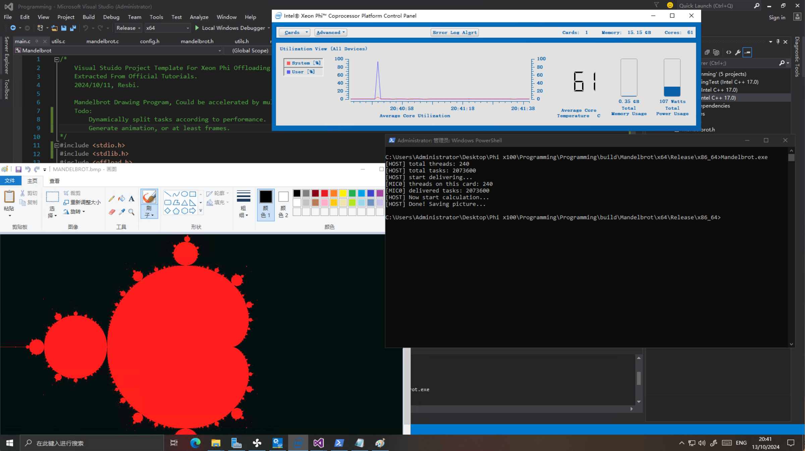

# Intel Xeon Phi Offloading Examples (Windows)

Here we have some Xeon Phi Offloading programs for Windows, wrote by myself. The VS template was extracted from official tutorials placed inside the MPSS installation folder. 

# Environment

- Windows Server 2022
- Visual Studio 2015 Community
- MPSS 3.8.6
- Intel Parallel Studio XE Cluster 2017u8
- __Intel Xeon Phi x100 Coprocessor 7120P__

# Examples

## Testing

Test offload avaliability. 

## Mandelbrot

A program drawing mandelbrot set, support multi Phi calculation. 

## DataTransmittingTest

Testing data transmitting performance. 

## GameOfLife

Todo...

## NBody-Particle

Todo...
