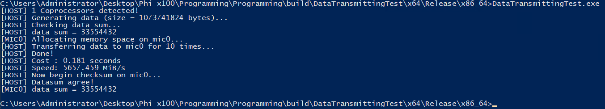

# Intel Xeon Phi Offloading Examples (Windows)

Here we have some Xeon Phi Offloading programs for Windows, wrote by myself. The VS template was extracted from official tutorials placed inside the MPSS installation folder. 

Since it's hard to learn how to create an offloading program by reading those official tutorials and broken-piece documentations on the internet\[doc.-1~3\], I decided to write some examples __explicitely__ show how to. 

# Environment

- Windows Server 2022
- Visual Studio 2015 Community
- MPSS 3.8.6
- Intel Parallel Studio XE Cluster 2017u8
- Gigabyte B450M 
- Ryzen R7 2700
- __Intel Xeon Phi x100 Coprocessor 7120P__

# Examples

## `Testing`

Test offload avaliability. 

## `DataTransmittingTest`

Test data transmitting performance. 

## `Mandelbrot`

A program drawing mandelbrot set, support multi Phi calculation. 

## `NBody-Particle`

Todo...

## `GameOfLife`

Todo...

## `MeshSolver`

# References
- \[doc.-1\] [High Performance Computing Pearls Vol.1 and Vol.2](https://www.amazon.com/High-Performance-Parallelism-Pearls-One/dp/0128021187)
- \[doc.0\] [Intel Xeon Phi Coprocessor Architecture and Tools](https://link.springer.com/book/10.1007/978-1-4302-5927-5)
- \[doc.1\] [Intel Xeon Phi Programming - LNCC Training](https://sdumont.lncc.br/media/11_Phi_Programming-KNC.pdf)
- \[doc.2\] [Intel Xeon Phi Coprocessor Quick Start Developers Guide](https://www.intel.com/content/dam/develop/external/us/en/documents/intel-xeon-phi-coprocessor-quick-start-developers-guide.pdf)
- \[doc.3\] [Introduction to Intel Xeon Phi Programming Techniques](https://indico.ictp.it/event/a14302/session/12/contribution/48/material/0/0.pdf)

